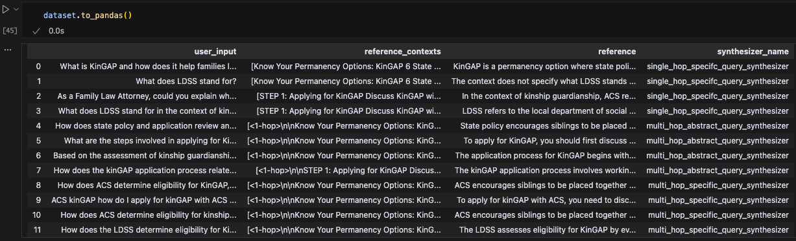

# AI Makerspace Certification Challenge

Loom video: https://www.loom.com/share/4a3167cc745744c9be0afce6e71c8061?sid=d82ff8f3-d186-4619-8767-26815e0b829c

## Task 1: Problem and Audience

**You are an AI Solutions Engineer.** What problem do you want to solve?  Who is it a problem for?

1. 1-sentence description of the problem
    - Economics and health researchers want to know which foster care policies lead to the best outcomes.
2. Why this is a problem for your specific user
    - Researchers (beginning with Brigham Young University and Washington University in St. Louis) have access to extensive data about foster care outcomes throughout the United States (adoption rates, length of time in foster care, how many children successfully returned to their parents or completed high school, etc). They want to understand which policies lead to the most desireable outcomes. They need a reliable way to explore how specific policies may be correlated with specific outcomes.
    - Each state has unique foster care policies and processes that may vary from year to year. This presents an ideal opportunity to see how different policies lead to different results, but there is not a standardized way to find or compare policies. The policies are publicly available online, but the websites that host them do not use a consistent format, structure, or update frequency. For example, some policies are published in PDFs and others are in HTML. Manually searching through these websites can be very time intensive (if you know what you're looking for) or infeasible (if you need to compare across all states).

## Task 2: Proposed Solution

1. Proposed solution.  How will it look and feel to the user?
    - Researchers will use a simple chat interface to ask questions about foster care policies. They will enter their question in a text box and click send (or press enter).
    - The system will search through state foster care policies to provide a relevant response. **Responses will link back to the original sources**, empowering researchers to quickly ask complex questions like: `Highlight policies in Colorado and California that differ from other states, especially if they may relate to likelihood of a child having multiple foster families.` Including context about the specific outcomes they're trying to understand may allow our system to identify meaningful insights. Or it could cause the system to make erroneous connections between cause and effect. In any case, our system will make cross-state comparison much faster than humans sifting through the many different policies. Using synthetically generated data and their own creativity, researchers will be able to quickly ask a wide array of questions with various amounts of context and identify specific sources that merit more rigorous study.
2. Describe the tools you plan to use in each part of your stack.  Write one sentence on why you made each tooling choice.
    1. LLM
        - `GPT 4.1`: The RAG model mainly needs to return relevant sources so it doesn't need to be super powerful (use `gpt-4.1-nano`), but we do want a more capable agent model to combine insight from various documents or web search results.
    2. Embedding Model
        - OpenAI's `text-embedding-3-small`: An inexpensive but effective embedding model for our initial prototype.
    3. Orchestration
        - `LangGraph`: Industry-leading open source framework that will allow us to easily chain RAG with agents, collect tracing information, and customize our product as it matures.
    4. Vector Database
        - `QDrant`: Industry-leading solution that will trivially scale from prototype to production.
    5. Monitoring
        - `LangSmith`: Easy integration with LangGraph for detailed tracing.
    6. Evaluation
        - `RAGAS`: Industry-leading sythetic data generation and metrics to understand how well our system is performing, especially as we make changes (metrics driven development).
    7. User Interface
        - `React`: Common framework that will be simple to vibe code and deploy.
    8. (Optional) Serving & Inference
        - N/A
3. Where will you use an agent or agents?  What will you use “agentic reasoning” for in your app?
    - An agent will be responsible for requesting source material from our RAG system _and_ web searches to see if there are any more recent sources that may be relevant to the user's request (for example if a state has recently updated its foster care policies).

## Task 3: Dealing with the Data

**You are an AI Systems Engineer.**  The AI Solutions Engineer has handed off the plan to you.  Now *you must identify some source data* that you can use for your application.  

Assume that you’ll be doing at least RAG (e.g., a PDF) with a general agentic search (e.g., a search API like [Tavily](https://tavily.com/) or [SERP](https://serpapi.com/)).

[x] Collect data for (at least) RAG and choose (at least) one external API

1. Describe all of your data sources and external APIs, and describe what you’ll use them for.
    - Manually downloaded sources (PDF or HTML) of state foster care policies (see examples in `data/` directory in this repository).
      - These high quality sources will be embedded in our Qdrant vector store to be retrieved by our RAG system.
    - `Tavily`: Search the web for additional sources that may have more recent information.
2. Describe the default chunking strategy that you will use.  Why did you make this decision?
    - We will start with `RecursiveCharacterTextSplitter` using a chunk size of 1000 characters and overlap of 200 characters. This is a simple default that we can start with and evaluate more sophisticated chunking strategies against.
3. [Optional] Will you need specific data for any other part of your application?   If so, explain.
    - Eventually we may include data about foster care outcome data or metadata tagging information to enable an agent to assist in coding new sources to be added to our data store. Our initial prototype will focus only on state policy information.

## Task 4: End-to-End Agentic RAG Prototype

[x] Build an end-to-end prototype and deploy it to a local endpoint

## Task 5: Creating a Golden Test Data Set

**You are an AI Evaluation & Performance Engineer.**  The AI Systems Engineer who built the initial RAG system has asked for your help and expertise in creating a "Golden Data Set" for evaluation.

[x] Generate a synthetic test data set to baseline an initial evaluation with RAGAS

- Done in `rag_evaluation.ipynb`:

1. Assess your pipeline using the RAGAS framework including key metrics faithfulness, response relevance, context precision, and context recall.  Provide a table of your output results.

| Retrieval Method | Faithfulness |	Response relevance |	Context precision (llm_context_precision_with_reference) |	context_recall |  
|-------------|----|---|----|-----------|
| Naive Retrieval |	0.9296 | 0.9641 |	0.6737 |	1.0000 |
| BM25 | 0.9539 | 0.9663 |	0.8727 |	0.9722 | 
| Contextual Compression |	0.9362  | 0.9664  |	1.0000  |	0.9306  | 
| Multi-Query |  0.9419	|  0.9586 |	 0.6515 |	1.0000  | 
| Parent Document | 0.8857	| 0.9592  |	 0.8819 |	0.9514  |
| Ensemble |  0.9822	| 0.9598  |	0.8246  |  1.0000 |

2. What conclusions can you draw about the performance and effectiveness of your pipeline with this information?

    - Our original "naive retrieval" approach performed quite well (all scores except context precision were fairly close to 1.0), but it was matched or outperformed by other retrieval methods in all metrics, so it's probably worth using a more advanced retrieval method, especially for improved context precision which will ensure the most relevant retrieved chunks are valued more highly than less relevant chunks. (Contextual compression seems especially helpful with this, as expected and as we can see it had a score of 1.0)
    - The system seems robust enough that it should provide researchers with helpful responses. We'll want to continue to evaluate and iterate as we add more data sources and have more real users interacting with the system.

## Task 6: The Benefits of Advanced Retrieval

**You are an AI Systems Engineer.**  The AI Evaluation and Performance Engineer has asked for your help in making stepwise improvements to the application. They heard that “as goes retrieval, so goes generation” and have asked for your expertise.

[x] Install an advanced retriever of your choosing in our Agentic RAG application.

- I used Contextual compression after comparing evaluation results.

1. Describe the retrieval techniques that you plan to try and to assess in your application.  Write one sentence on why you believe each technique will be useful for your use case.
    - `BM25`: Quickly finding documents that exactly match keywords would likely be helpful for researchers exploring very specific topics or policies.
    - `Contextual Compression`: Spending more computation narrowing down quickly retrieved sources should increase context precision and promote the most relevant sources. 
    - `Multi-Query`: It seems worth evaluating, but I don't anticipate multi-query retrieval being very useful for experienced researchers who are asking very specific questions. The additional generated questions may distract from the results they're seeking. On the other hand, it could lead to related lines of research they may not have originally considered.
    - `Parent Document`: This technique seems especially promising to me since we can embed and match very specific child chunks but then return broader source content that may be of interest to researchers.
    - `Ensemble`: Though slower and more expensive, higher quality results coming from multiple retrieval techniques would probably be valuable to researchers, especially as our source data continues to grow.
2. Test a host of advanced retrieval techniques on your application.
    - Done. See table in Task 5.1

## Task 7: Assessing Performance

**You are the AI Evaluation & Performance Engineer**.  It's time to assess all options for this product.

[x] Assess the performance of the naive agentic RAG application versus the applications with advanced retrieval tooling

1. How does the performance compare to your original RAG application?  Test the fine-tuned embedding model using the RAGAS frameworks to quantify any improvements.  Provide results in a table.
    - See table in Task 5.1  All retrieval techniques performed very well in response relevance and context recall (>0.93). All techniques except parent document retriever had better faithfulness than naive retrieval. All techniques except multi-query retrieval improved context precision, with contextual compression achieving a score of 1.0
2. Articulate the changes that you expect to make to your app in the second half of the course. How will you improve your application?
    - Integrate vector store with existing Mendix database so I can use the full quality, coded sources of state policies.
    - Ensure relevant source metadata is available in RAG and referenced in final responses.
    - Add sources for more states and generate synthetic data with personas specifically designed to be economics researchers asking about multiple states.
        - Embed more documents, shuffle chunks, and generate synthetic data using the first few (~20) chunks to get a more diverse generated dataset.
    - Persist vector store so sources don't have to be chunked and embedded on every request.
    - Add more robust LangSmith configuration for tracing and metrics analysis.
    - Explore graphRAG vs vector embeddings as a way to find interesting connections across state policies.
    - Provide guardrails to ensure our system only answers questions about foster care.
    - Deploy frontend so researchers can use the system and provide feedback (probably using their own OpenAI API key or by securely using the univerity's key)